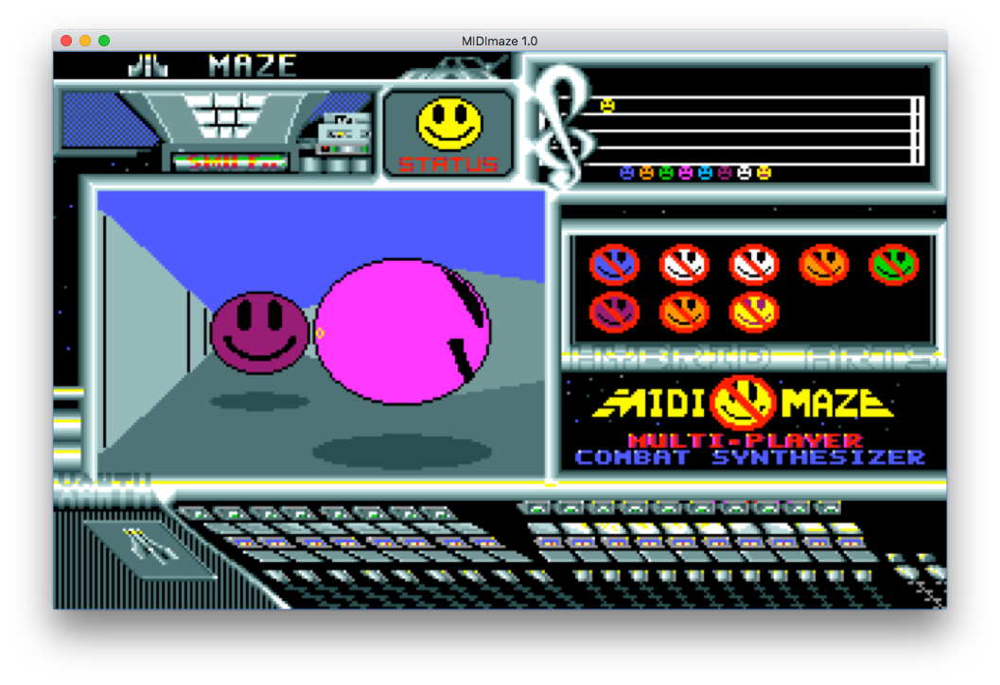

# MIDImaze Source Code

The reverse-compiled C source code for the original MIDImaze (or MIDI-Maze or MIDI maze - however you want to spell it). While I have not tested it on a real Atari ST, it does compile and run on a macOS with Xcode just fine (without MIDI) - on an Intel machine, in 64-bit! You can even pick, if you like to run it in b/w or in color.

This is not rewritten code, but the original code, which I've converted back from assembler to C with a Python Script I wrote over the past years. The names of the functions and data structures are obviously mine, also all comments in the code. I have however kept the code identical to the original, so it _should_ be possible to generate the original game from this code. If you care, change it back (search for `ATARI_LONG_HACK`). It needed to change to work on Intel based computers or computer with long > 32bit. Also the division-by-zero `BUGFIX_DIVISION_BY_ZERO` check is not needed on a 68000. You could also disable all bugfixes (`BUGFIX_MIDI_TIMEOUT` and `BUGFIX_UMLAUTS_IN_NAMES`), if you want to…

I've added extensive documentation and comments to the source code. If you like to learn about 3D maze games on a machine, which technically is too slow for them (consider that MIDImaze shipped many years before Wolfenstein 3D!), this is for you! You can also learn about why drones behave the way they do.

Documentation about certain areas of MIDImaze:

- [MIDImaze Sources](./src/)
- [MIDImaze Engine Overview](./README/MIDImazeEngineOverview.md)
- [MIDIMAZE.D8A File Format](./README/D8AFileFormat.md)
- [MIDI Communication](./README/MIDICommunication.md)
- [File format of the compressed title screens](./README/CompressedTitle.md)
- [Atari Screen Bitmap Format](./README/AtariScreenBitmap.md)

## macOS version

I've added a working Xcode project and sources for macOS to allow running MIDImaze on a Mac. It contains the BIOS/XBIOS/AES/VDI functions which are necessary to get it to run. The MIDImaze dialogs have been generated as Mac-native XIB dialogs, also the menu bar is native. It manages the Atari screen bitmap and renders it into an NSImage view. Even a small font render with some VT52 support and the original Atari ST fonts are included to maintain the original look. The original MIDImaze code actually runs on a different thread and is synchronized with the Mac-UI via GCD. Sounds risky to have 2 threads, but it is rock solid (the API doesn't really allow mistakes)

Start the game via the menu or press 'Return'. You can control the player with the cursor keys and shoot with '0' (the space-bar is already used by MIDImaze for the map, Esc quits the game)

## MIDI-Maze 2

I might add a branch to the project to add the Midi-Maze 2 changes to it. We'll see.
